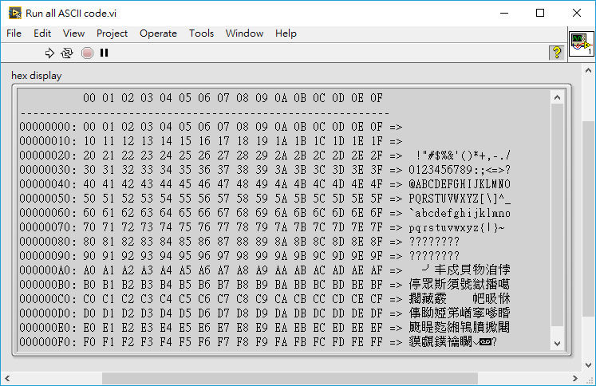

LV-string2hex-view
==

[中文版](README_chi.md)

Render LabVIEW string into hex display.

## How does it work?

Convert LabVIEW string into hex display.

Features:

- Single `string2hex.vi` file and basic LabVIEW environment required
- Line number in hex (e.g. `0000000F:`)
- Byte number in hex (in the header line on ...`---`...)
- Raw data display in hex (e.g. ...`EB 90 00 01`...)
- The corresponded ASCII string separated by `=>`

## Environment

Any distribution of LabVIEW 2016. No add-on or module required.

## VI usage

`string2hex.vi`

Wire anything that is flatten into string to the input of this VI, it returns the hex display in LabVIEW string. Please create a LabVIEW *String indicator* by right click the VI's output and select *Create » Indicator* from the pop-up menu.

Users can also check the usage of each VI using *Context Help*.

## Examples

`Open file in hex view.vi`:

Users can use this VI to open any binary file into hex viewer. Open this VI and select `data.dat` in the `examples/` folder from the LabVIEW controller **file path**. The hex presentation would show up in the **hex display**. Users can use this VI as a simple hex viewer.

See below figure for the VI run result.

*Notice: DO NOT use this VI to preview large file.*

`Run all ASCII code.vi`

Users can use the VI the check the result of hex display from all ASCII code (`0x00 to 0xFF`).

## Customization

You can customize the hex display format by editing the `string2hex.vi` (if you are brave lol ).
