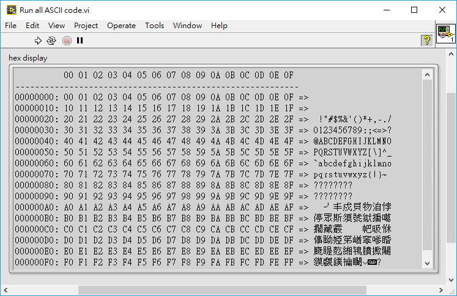

LV-string2hex-view
==

[English version](README.md)

將 LabVIEW 字串用 hex viewer 的方式呈現。

## 概覽

把 LabVIEW 字串餵給 `string2hex.vi`，字串內容便會被轉換並以 hex 的方式呈現，如下圖：

功能包含：

- 僅需要單一 VI（`string2hex.vi`）與基本的 LabVIEW 工作環境即可運作
- 十六進位的行號顯示 (例：`00000010:`)
- 十六進位的位元組編號（於 ...`---`... 上方）
- 十六進位的原始 hex 顯示資料 (例 ...`EB 90 00 01`...)
- 顯示所對應的 ASCII 的字串（於 `=>` 後面）

## 環境

LabVIEW 2016 基本版，無需安裝額外模組。

## 怎麼使用

### `string2hex.vi`

將要以 hex 來顯示的資料轉換（flatten）為字串型態，並餵到該 VI。請於 VI 的輸出端點選擇 *Create » Indicator* 來產生 *string indicator*，其內容即為 hex 顯示的資料。

使用者透過 *Context Help* 取得該 VI 的更多資訊。

## 範例程式

請至專案底下的 `examples/` 目錄取得範例程式。包含 `Open file in hex view.vi` 與 `Run all ASCII code.vi`。
