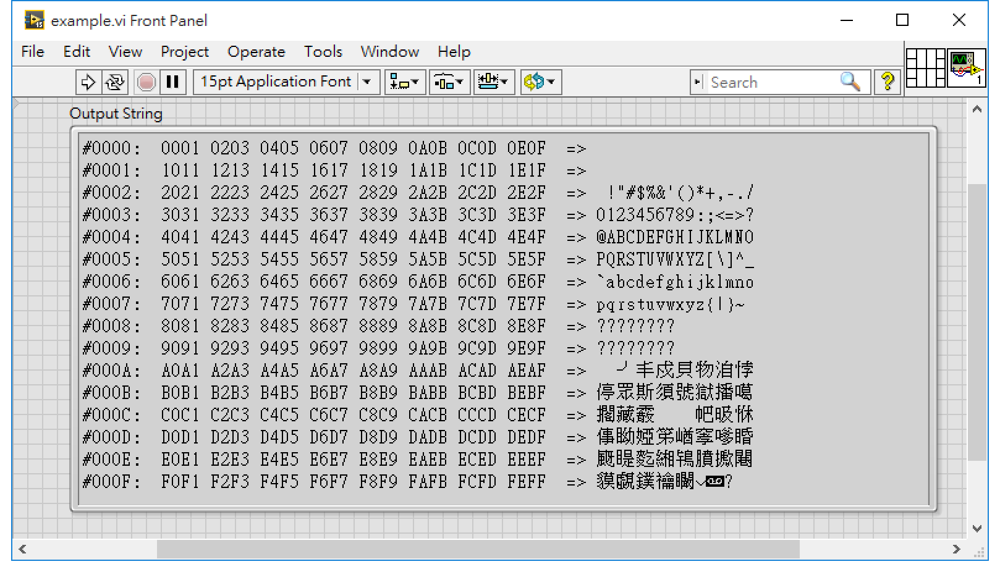

LV-string2hex-view
==

將 LabVIEW 字串用 hex viewer 的方式呈現

## 如何運作？

把 LabVIEW 字串拉進 `string2hex.vi` 這個 subVI，會以下圖的方式呈現：

包含：

- 16 進位的行號 (例：`#000F`)
- 16 進位的原始資料 (例 ...`EB90 0001`...)
- 對應的 ASCII 的字串

## 怎麼使用

只需要 `string2hex.vi` 這個檔案：

- **輸入**：LabVIEW 字串或 Byte array（需轉換）
- **輸出**: 以 hex viewer 方式呈現的 LabVIEW 字串
- **選項**: 分隔字串（預設是 `"=>"`)，可以套用自己喜歡的字串
